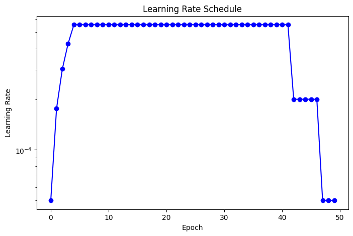
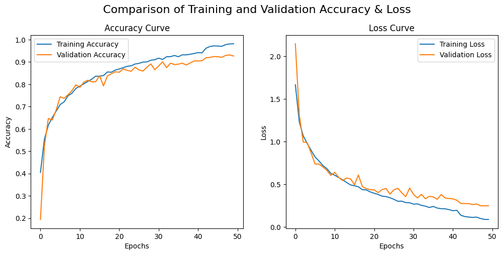

# Mel-Spectrogram Music Genre Classifier

**Goal:**  

Classify music genres using a hybrid CNN–LSTM network optimised for Mel-spectrogram inputs.

---

## Model Architecture

The model extracts time–frequency patterns using **two parallel CNN branches**, each capturing different receptive fields:

- **Branch 1:** Conv2D(32, 5×5) → LeakyReLU(0.3) → MaxPool(4×4) × 2  
- **Branch 2:** Conv2D(32, 3×3) → LeakyReLU(0.3) → MaxPool(2×2) × 2  

Features from both branches pass through **LSTM(128 → 32)** layers, then are concatenated and fed to a Dense → Softmax classifier.

Conv2D is used instead of Conv1D to preserve full time–frequency structure.

---

## Optimisation Strategy (Key Contribution)

This project focuses heavily on **systematic optimisation** of the model’s regularisation, training dynamics, and sequence modeling quality.

### 🔹 Regularisation & Stabilisation
- **Batch Normalisation** after every Conv2D to stabilise feature scaling  
- **Dropout (p = 0.2)** after pooling to reduce overfitting  
- **L2 weight regularisation**  
- **He normal initialisation** for variance-stable convolutional layers  
- **Leaky ReLU (α = 0.3)** to avoid dead activations and mitigate vanishing gradients  

### 🔹 Learning Rate 
A **manually designed multi-stage learning rate schedule** was implemented to balance fast initial convergence with stable late-stage optimisation:

- **Epochs 1–5:** linear warm-up from 5e−5  
- **Epochs 5–41:** main training at 5.55e−4  
- **Epochs 42–46:** reduced to 2e−4 for stabilisation  
- **Epochs 47–50:** final annealing to 5e−5  

This schedule significantly improved convergence and prevented overshooting during early optimisation.

### 🔹 Data Augmentation 
Augmentations (noise, time-shift) were initially applied to enforce i.i.d. batches, but **empirically decreased validation accuracy** due to correlated song segments.  
Final model therefore trains **without augmentation**, confirming that optimisation choices should follow data dynamics, not assumptions.

---

## Key Findings

- Multi-kernel CNN branches improve generalisation by capturing features at different scales.  
- LSTMs effectively model temporal dependencies not captured by CNNs alone.  
- The custom LR schedule and BN–Dropout combination are crucial for overcoming early overfitting.  
- Empirical evaluation showed augmentation was counterproductive given dataset structure.  

---
## Result

Achieved 93% in validation set.

---

**Tools:** Tensorflow, KerasTuner 

**Notebook:** `mel_spectrogram_classifier.ipynb`

