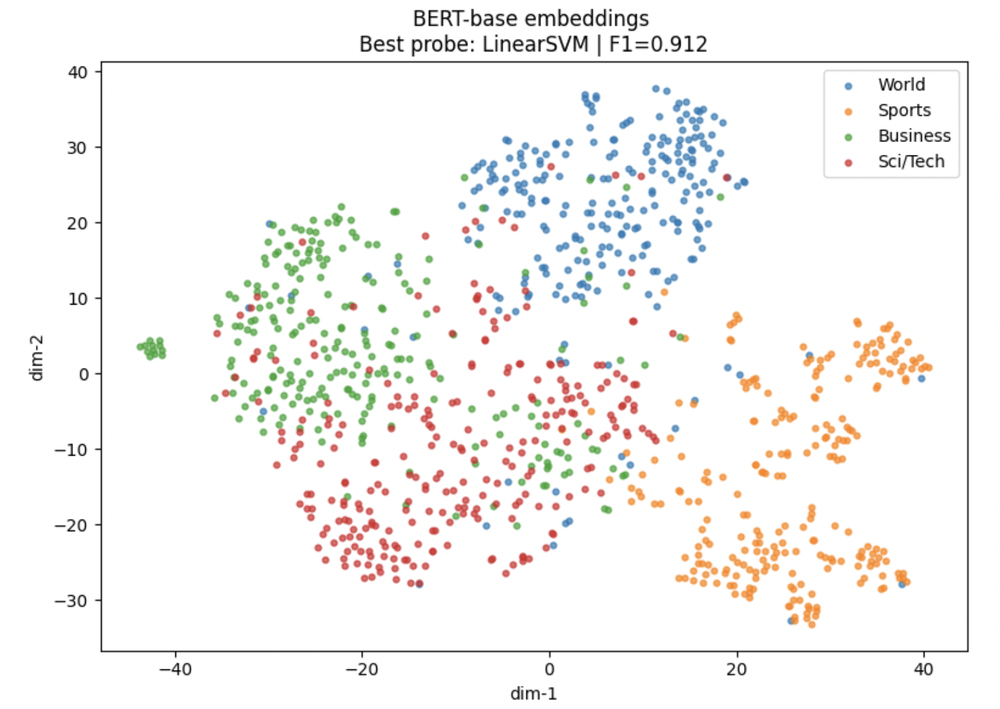

# News Topic Clustering with Transformer Embeddings

**Goal:**  
Evaluate how well pretrained Transformer models separate news topics in the **AG News** dataset.

---

## Summary

This project compares sentence embeddings from:

- **all-MiniLM-L6-v2**
- **BERT-base-uncased**
- **RoBERTa-base**

Headlines are encoded via **mean pooling** of last-hidden-state representations and **L2-normalised** for stable probing.  
Topic structure is analysed using:

- **PCA → t-SNE** for 2D visualisation  
- **Linear probes** (Logistic Regression, Linear SVM, Ridge)

---

## Dataset

This project uses the **AG News** dataset from the *HuggingFace Datasets* library:

- **Source:** Zhang, Zhao & LeCun (2015), "Character-level Convolutional Networks for Text Classification"
- **Access:** `datasets.load_dataset("ag_news")`
- **Structure:** 4 balanced topic classes — *World*, *Sports*, *Business*, *Sci/Tech*
- **Size:** 120,000 training samples and 7,600 test samples (headlines + labels)

---

## Method

**Embedding Extraction**
- Tokenise (max_len=128) → model forward pass  
- Mean pooling with attention mask  
- L2-normalised sentence vectors  

**Linear Probing**
- Train 3 linear classifiers (e.g., Multinomial Logistic Regression, Linear SVM, Ridge Classifier)
- Select best model by **F1-macro** across 4 topics  
  (*World, Sports, Business, Sci/Tech*)

**Visualisation**
- PCA (50 dims) → t-SNE (2 dims)  
- Per-topic colour-coded clusters

---
## Result

### Probe Performance Summary

| Model         | Best Probe | Test Acc | Test F1 (Macro) | Emb Dim | Train N | Test N |
|---------------|------------|----------|------------------|---------|---------|--------|
| **RoBERTa-base** | LinearSVM | **0.9141** | **0.9140** | 768 | 120,000 | 7,600 |
| **BERT-base**    | LinearSVM | 0.9120 | 0.9118 | 768 | 120,000 | 7,600 |
| **MiniLM**        | LinearSVM | 0.8958 | 0.8956 | 384 | 120,000 | 7,600 |

- **RoBERTa-base** achieved the strongest probe performance (Test Acc ≈ 0.914), producing the most accurate topic separation.  
- **BERT-base** performed slightly below RoBERTa but remained competitive (Test Acc ≈ 0.912).  
- **MiniLM**, despite its smaller embedding size, showed the weakest probe accuracy (≈ 0.896), confirming the trade-off between compactness and linear separability.

---

### Embedding Space Visualisation

---

**Tools:** HuggingFace Transformers, SentenceTransformers, scikit-learn  
**Notebook:** `News_Topic_Clustering.ipynb`
